# ContactAnalysis

大理石接触分析

### 一、环境介绍

* 系统：win10
* 语言：python3.7
* 依赖库：opencv、numpy、PyQt

### 二、功能说明

实际工程中，为了得知路面沥青质量的好坏，需要对其进行数据分析。如下三幅图所示，原图是路面沥青切片，第二幅图是原图的二值化图像（处理的这么好，当然是PS的），第三幅图画出了原图沥青石块之间的接触点。如果人工进行标注的话，工程量过于巨大，所以现在需要通过软件来实现对原图完成数据分析，需要完成以下几个功能点：

* 二值化处理（难点）
* 石块接触分析：以二值化后的图像为基础，计算每个石块的面积，标记出石块间的接触点，计算每个石块质心位置。
* 输出图像：
  * 大于2.36mm粗石料接触点位置（两张：点接触图像、线接触图像）
  * 接触点连接图
  * 接触点Voronoi图
  * 大于2.36粗石料的形心连接图
* 输出参数：
  * 相互接触大于2.36mm粗石料的面积
  * 接触点总数量
  * 平均匹配数
  * 图像总面积
  * 接触石料总面积
  * 只有一个接触点石料的总面积
  * 无接触石料的总面积（未完成）
  * 参数A：接触石料总面积/图像总面积
  * 参数B：无接触石料总面积/图像总面积

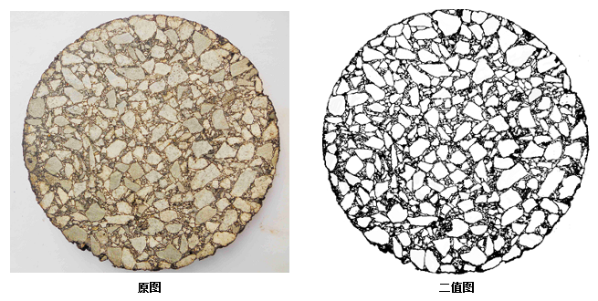

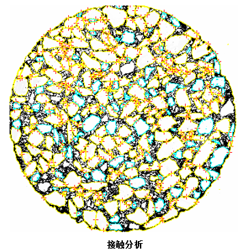


### 三、实现步骤

在本小节，由于Qt界面的实现太没有技术含量，省略，不介绍。

#### 3.1 二值化

经过不停的摸索，翻遍了百度、google、论文，没有一步就可以将其二值化到上图所示的方法，什么OSTU[^1]算法是不行的，由于它是统计整张图片的像素直方图，在光照不均匀的情况下，会产生极大的误差，阴暗位置会产生极大的误差。

~~（如果有足够的数据集，应该可以使用U-net来做）~~

为了得到合适的二值化图像，采用opencv的`adaptiveThreshold`自适应二值化[^2]函数，该函数是基于小窗口二值化方法，在光照不均匀的情况下也可以得到较好的二值化结果，但是这种方法由于其本身的特性，虽然得到较好的轮廓效果，但是也会产生较大的噪声，如下图所示：

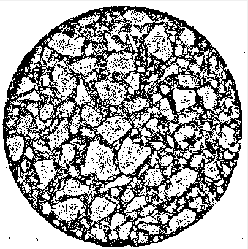

在上图中，虽然噪声对，但是轮廓也比较明显，接下来需要借用到opencv的`findContours`轮廓分析[^3]方法，在参考文献中记录了该方法的使用方法，以及一些应用方法。首先使用该方法去除石块外的其他噪声，去除结果如下：


接下来，采用`findContours`给出深度[^3]信息（用到多叉树遍历算法，不能使用递归，python的机制里面，一个函数重复调用2000多次后，会强制中断程序，需手动构建堆栈），去除掉最里面的轮廓，去除结果如下：

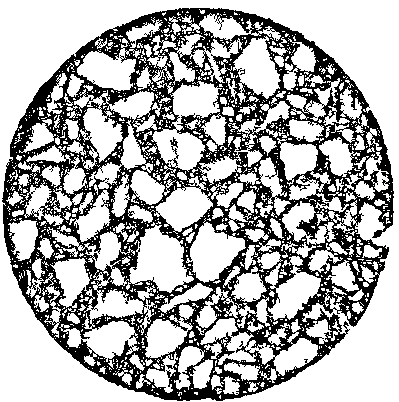

接下来，采用`findContours`给出的轮廓大小信息，去除掉小于用户指定尺寸的石块，结果如下所示：

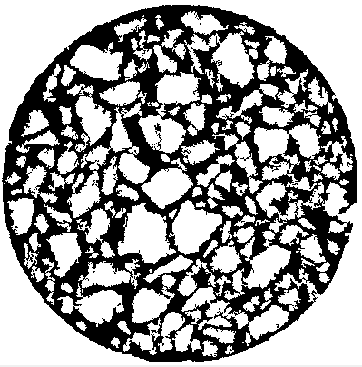

看的出来，噪声还是很大，没关系，因为这不是最后的二值化图像，还需要使用分水岭算法进行最终的处理，处理之后根据`findContours`方法去除小碎块和最外层边框，处理结果如下：

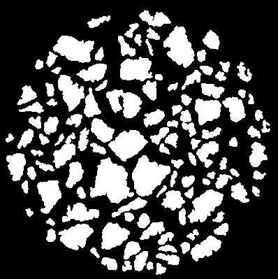

至此，石块的二值化结束（为什么和要求的不一样，因为这种二值化，更加方便后续处理），不去除最外层边框就可以和第二章功能说明里面一样！！

#### 3.2 计算石块面积

在opencv中通过`contourArea`结合`findContours`方法可以快速得到每个块的像素点个数，成功得到每个块的面积。

```python
self.blocksSize.append([contourIndex, cv2.contourArea(contrs)]) 
```

* contourIndex：为石块的下标。
* cv2.contourArea(contrs)：该石块的面积

将每个石块的大小记录在`self.blocksSize`。

#### 3.3 计算接触点

> 点接触：两个石块之间只显示一个接触点。
>
> 线接触：两个石块之间，显示满足阈值距离的所有接触点

##### 3.3.1 分析

这一步需要得到点接触和线接触，而点接触可以从线接触中获得，所以先获得所有的线接触。实现步骤：

* 对每个石块的边缘进行标记，通过像素标记，如果是1，则其像素为（0,0,1）。
* 遍历所有的块，在每个块的边缘，以圆为半径找其他块的边缘，满足则记录在数据中。
* 点接触：在线接触中，提取出点接触

##### 3.3.2 对石块标记

直接上代码，通俗易懂：

```python
    def generateMasker(self, contour):
        masker = np.zeros_like(self.image)

        for contourIndex, contrs in enumerate(contour):
            if cv2.contourArea(contrs) < self.blocksize:
                continue
            # 对每一个块进行编码
            x1 = int((contourIndex + 1) / (256 * 256))
            x2 = int(((contourIndex + 1) - 256 * 256 * x1) / 256)
            x3 = int((contourIndex + 1) - 256 * 256 * x1 - 256 * x2)
            cv2.drawContours(masker, contour, contourIndex, (x1, x2, x3), thickness=1)

        return masker
```

输入是通过`findContours`得到的轮廓信息，返回的masker就是编码成功的图层。

##### 3.3.3 计算线接触

暴力法计算点附近是否有临近点，代码比较复杂，但原理比较简单，动图比较通俗易懂，直接上GIF：

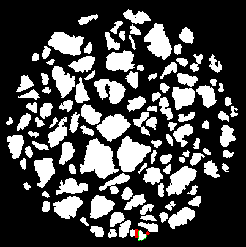

红色是所有满足条件的接触点，边框变绿表示该轮廓已经计算过，不再参与计算，可以看到，计算速度比较慢，毕竟是暴力法计算。

再说一下数据结构，看代码中的注释就好，将上面得到的接触点存入下面的数据结构中，后面使用起来就会美滋滋。

```python
# -*- coding: utf-8 -*-
# @Time    : 2020/1/22 21:04
# @Author  : zwenc
# @Email   : zwence@163.com

from operator import itemgetter


class contactsLinePointInfo(object):
    """
    线接触点信息，记录所有满足条件的点
    """

    def __init__(self):
        self.PointInfo = []

    def appand(self, index1, index2, point1, point2, dis):
        """
        index1: 石块1
        index2: 接触的石块2
        point1: 接触点中心x坐标
        point1: 接触点中心y坐标
        dis: 半径
        """
        if len(self.PointInfo) == 0:
            self.PointInfo.append(TowBlocksContactsInfo(index1, index2, point1, point2, dis))
            return

            # 查找 index1和index2是否已经存在
        for towBlocksContactsInfo in self.PointInfo:
            if towBlocksContactsInfo.compareIndex(index1, index2):
                # 存在，则在里面加点
                towBlocksContactsInfo.append(point1, point2, dis)
                return

        # 不存在，则new一个两个石块接触信息
        self.PointInfo.append(TowBlocksContactsInfo(index1, index2, point1, point2, dis))

    def __len__(self):
        return len(self.PointInfo)

    def __getitem__(self, item):
        return self.PointInfo[item]


# 将两个石块最小记录的最小单位
class TowBlocksContactsInfo(object):
    def __init__(self, index1, index2, point1, point2, dis):
        self.index1 = index1
        self.index2 = index2

        self.pointInfo = [point1, point2, dis]

    def append(self, point1, point2, dis):
        self.pointInfo.append([point1, point2, dis])

    def compareIndex(self, index1, index2):
        if self.index1 == index1 and self.index2 == index2:
            return True

        if self.index2 == index1 and self.index1 == index2:
            return True

        return False

    def getCoordinateByMiddle(self):
        # 根据坐标，将中间的点作为接触点位置返回

        self.pointInfo.sort(key=itemgetter(0))

        index = int(len(self.pointInfo) / 2)

        return self.pointInfo[index]

    def getCoordinateByMinDis(self):
        # 根据距离返回接触点位置
        self.pointInfo.sort(key=itemgetter(2))

        return self.pointInfo[0]

    def __len__(self):
        return len(self.pointInfo)

    def __getitem__(self, item):
        return self.pointInfo[item]


```


#### 3.4 计算形心位置

opencv一键操作

```python
retval, labels, stats, centroids = cv2.connectedComponentsWithStats(thresh)
for index in range(centroids.shape[0]):
    x, y = centroids[index]
    if index == 0:
        continue

self.drawCross(CentroidImage, (int(x), int(y)), (0, 0, 255), 4, 1) # 画十字叉
```


#### 3.5 画形心连接图

使用`cv2.Subdiv2D`一键操作

```python
        im_gray = cv2.cvtColor(self.marbleinformation.blockImage, cv2.COLOR_RGB2GRAY)
        _, thresh = cv2.threshold(im_gray, 128, 255, cv2.THRESH_BINARY)

        retval, labels, stats, centroids = cv2.connectedComponentsWithStats(thresh)
        size = self.marbleinformation.image.shape
        rect = (0, 0, size[1], size[0])
        subdiv = cv2.Subdiv2D(rect)

        for index in range(centroids.shape[0]):
            x, y = centroids[index]
            if index == 0:
                continue

            self.drawCross(CentroidImage, (int(x), int(y)), (0, 0, 255), 4, 1) # 画十字叉
            subdiv.insert((x, y))

        triangleList = subdiv.getTriangleList()

        for t in triangleList:
            pt1 = (t[0], t[1])
            pt2 = (t[2], t[3])
            pt3 = (t[4], t[5])
            if self.rect_contains(rect, pt1) and self.rect_contains(rect, pt2) and self.rect_contains(rect, pt3):
                cv2.line(CentroidConnectImage, pt1, pt2, [255, 255, 255], thickness=2)
                cv2.line(CentroidConnectImage, pt2, pt3, [255, 255, 255], thickness=2)
                cv2.line(CentroidConnectImage, pt3, pt1, [255, 255, 255], thickness=2)
```

#### 3.6 画接触点Voronoi图

得到接触点之后，opencv一键操作

```python
        img = np.zeros_like(self.marbleinformation.image)
        size = self.marbleinformation.image.shape
        rect = (0, 0, size[1], size[0])
        subdiv = cv2.Subdiv2D(rect)
        for x, y, _ in self.contactsPoints:
            subdiv.insert((x, y))

        (facets, centers) = subdiv.getVoronoiFacetList([])

        for i in range(0, len(facets)):
            ifacet_arr = []
            for f in facets[i]:
                ifacet_arr.append(f)

                ifacet = np.array(ifacet_arr, np.int)
                color = (random.randint(0, 255), random.randint(0, 255), random.randint(0, 255))

                cv2.fillConvexPoly(img, ifacet, color)
                ifacets = np.array([ifacet])
                cv2.polylines(img, ifacets, True, (0, 0, 0), thickness=1)
                cv2.circle(img, (centers[i][0], centers[i][1]), 3, (0, 0, 0), thickness=-1)
```

### 四、结果展示

形心图：

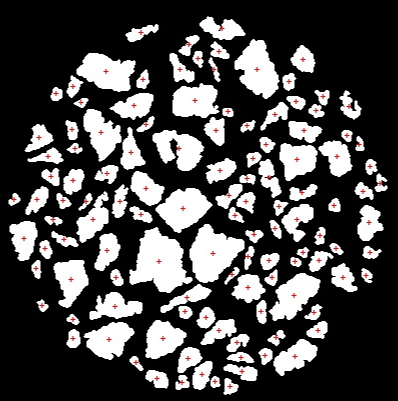

形心连接图：

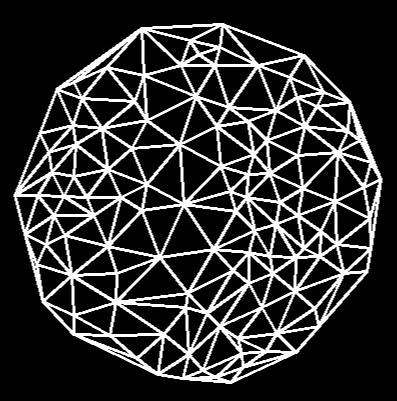

点接触图：

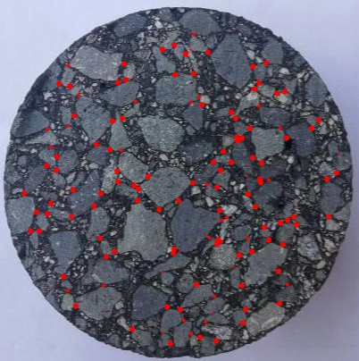

线接触图：

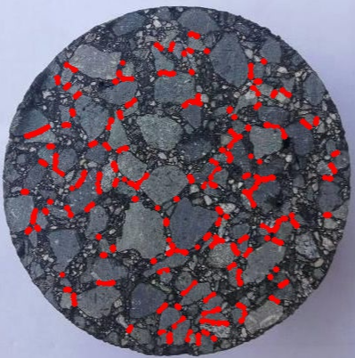

接触点Voronoi图：

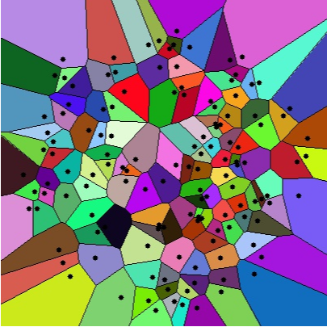

参数输出：

```python
接触点数量：133
平均匹配数: 1.13
石块总面积: 1824.46 mm2 
有接触石块面积: 582.67 mm2 
无接触石块面积: 80.9 mm2 
参数A(接触石料的总面积/石块总面积): 31.94 % 
参数B(无接触石料的总面积/石块总面积): 4.43 % 
```

```python
块大小：
0: 2.177 mm2 
1: 1.161 mm2 
2: 1.841 mm2 
3: 4.110 mm2 
4: 4.629 mm2 
5: 5.546 mm2 
6: 1.314 mm2 
7: 2.482 mm2 
8: 2.207 mm2 
9: 5.783 mm2 
10: 12.765 mm2 
11: 3.201 mm2 
12: 1.726 mm2 
...
```

Qt操作界面展示：

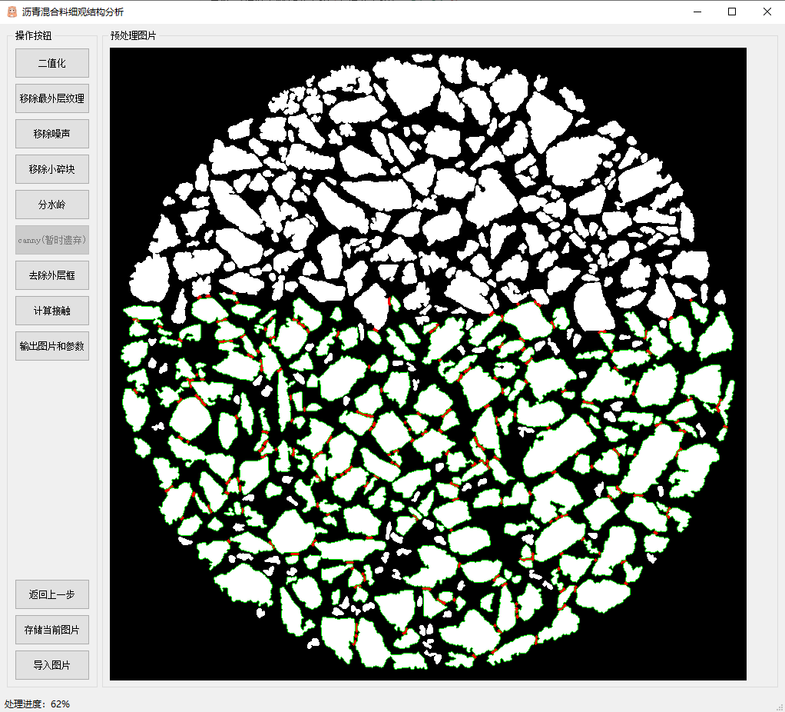

有些点（边缘为白色的小石块）没有计算，是因为不满足设置的最小石块的大小，所以会跳过计算。

### 五、总结

本次项目从上手，到结束大概用了2个多月时间。写完总结，本项目就告一段落了，感谢在项目中帮助我的所有人，在下收获颇丰。

高兴之余说一下不足的地方

* Voronoi图不应该连接图片边界，而是应该连接石块边界。
* 分水岭算法做的不好，石块大小没有完全还原，误差相对较大。

~~（代码暂时没有考虑上传）~~

### 参考文献

[^1]: [OSTU（大津算法）](https://blog.csdn.net/Touch_Dream/article/details/79750249)
[^2]: [adaptiveThreshold()函数](https://blog.csdn.net/sinat_36264666/article/details/77586964)
[^3]: [opencv - 轮廓查找和简单操作](https://www.zwenc.cn/da44c36f/)